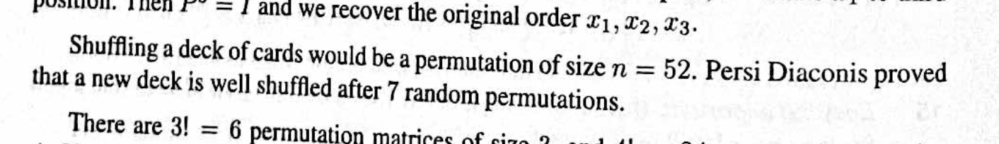
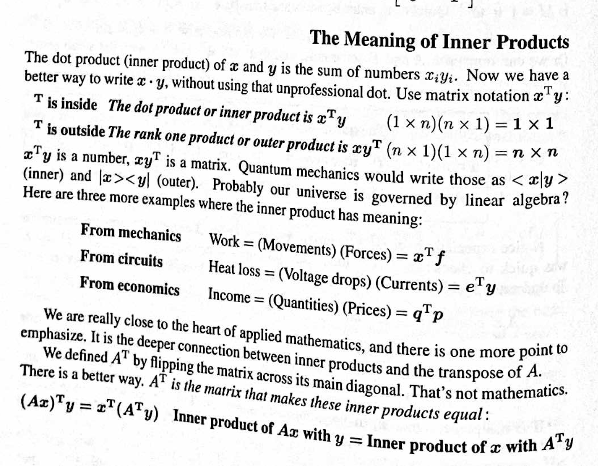
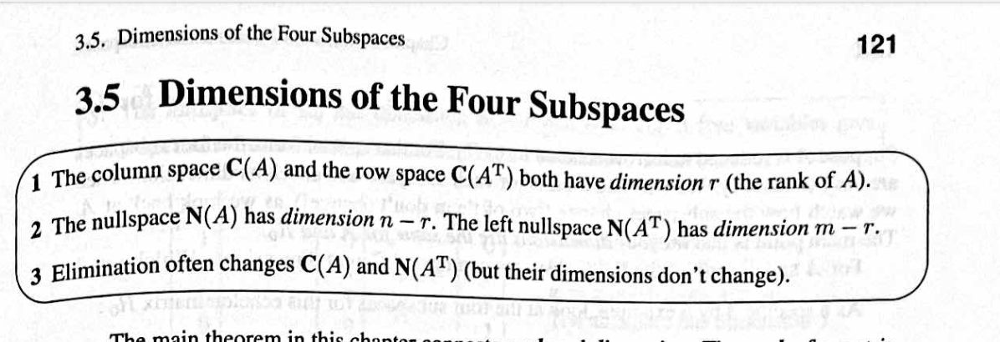

# [Linear Algebra for Everyone](https://math.mit.edu/~gs/everyone/) (Gilbert Strang, 2020)

---

space ! (old-fashioned? or what?)

---

> "The main rule of linear algebra is _keep going._" (page 24)

This seems like general advice for a student, not really a rule of linear algebra...

---

> "*Author's note* The words "column space" have not appeared in Chapter 1 of my previous books. I thought the idea of a _space_ was too important to come so soon. Now I think that the best way to understand such an important idea is to see it early and often. It is examples more than definitions that make ideas clear-in mathematics as in life." (page 24)

> It is examples more than definitions that make ideas clear

---

Says still on page 24:

(Amazing) The _r_ rows of _R_ are a basis for the *row space* of _A_ : combination of rows.

R from A = CR

---

> "I believe that this is the first great theorem in linear algebra." (page 25, re: column rank = row rank)

---

> "linear algebra says" (page 28... do not love)

---

> "We can multiply _AB_ if their shapes are right. When _A_ has _n_ columns, _B_ must have _n_ rows." (page 29; ugh ugh ugh)

---

his covid project

---

page 33:

> *Why is Matrix Multiplication _AB_ Defined This Way ?*

> The definition of _AB_ was chosen to produce this crucial equation: *_(AB)_ times _x_ is equal to _A_ times _BX_.* This leads to the all-important law *_(AB)C = A(BC)_*. We had no other reasonable choice for _AB_ !

This is better than his earlier book... at least acknowledges that it's a choice...

---

On page 42, at least it isn't augmented, but it's just jumping into "Multiply that row by 2 and *subtract* from row 2."

and why do we have to use this "pivot" word???

---

(it even lost the connection to the usual algebra elimination approach!?)

---

page 61, A=LDU asked for, without explanation, in Problem Set 2.3

---

page 64

but no; a riffle shuffle is not a random permutation
https://projecteuclid.org/journals/annals-of-applied-probability/volume-2/issue-2/Trailing-the-Dovetail-Shuffle-to-its-Lair/10.1214/aoap/1177005705.full?tab=ArticleFirstPage
what a weird thing to say

---

page 66 section on:

"Partial Pivoting" to Reduce Roundoff Errors

is talking about "The computation is more stable if" blah blah

then there's the FFT example, which is admittedly cool...

---

transpose is discussed before introduced on page 67

---

page 68 - fun examples?

---

trying to explain stuff so much, but then in 3.2 it's "special solutions" and "Set to 0 and 1" and not a lot of rationale

---

> The word _echelon_ means that the 1's in R_0 go steadily down, left to right. (page 85)

real origin is cooler... "late 18th century (in echelon (sense 2 of the noun)): from French échelon, from échelle ‘ladder’, from Latin scala"

---

occasional mentions of MATLAB...

---

3 is some BS

(because "elimination" really means multiplying by other matrices, so A isn't the same afterward, and it's the spaces of the product that it's talking about here...)
